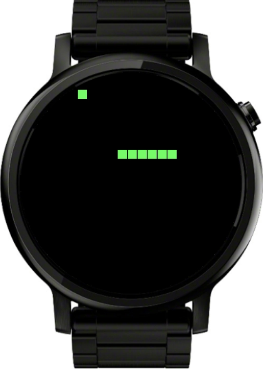
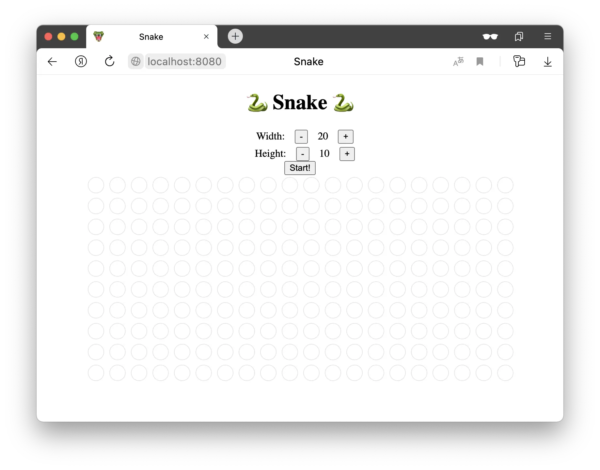
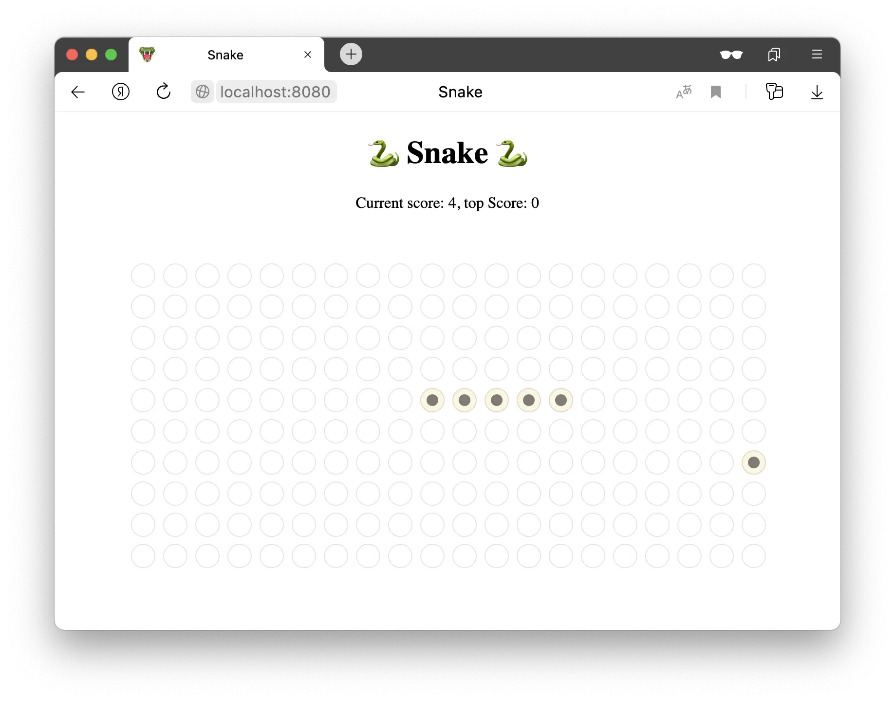
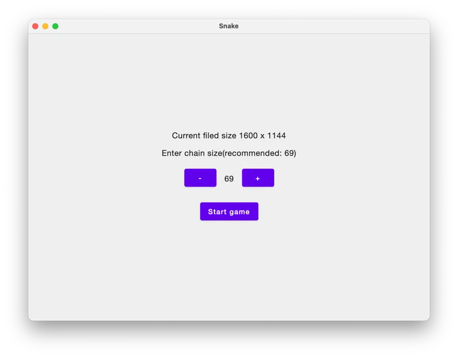
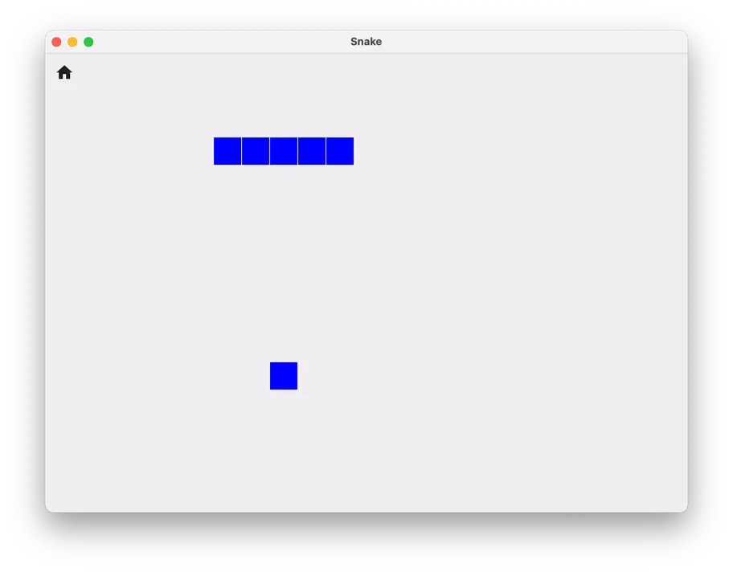
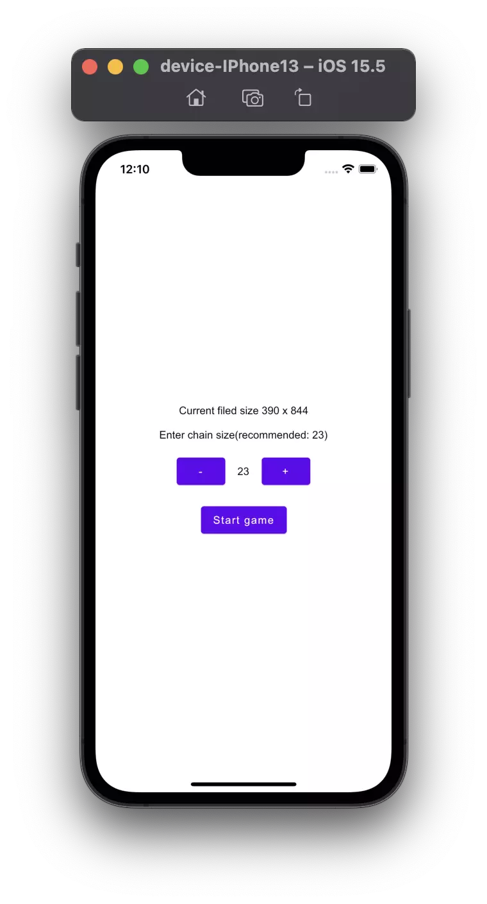
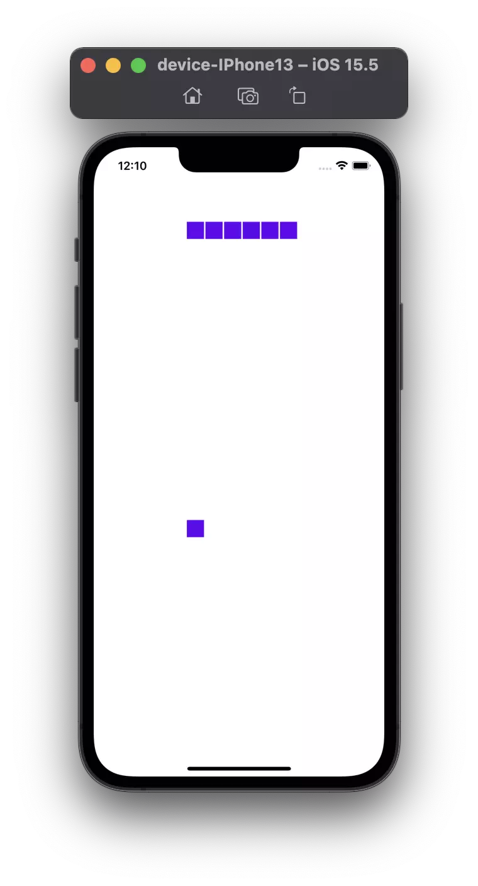

<h1 align="center">Kotlin multiplatform Snake</h1> 
<p align="center">
  <a href="#">
    
  </a>
  <a href="https://developer.android.com/jetpack/androidx/releases/wear-compose">
    
  </a>
    <a href="https://www.jetbrains.com/lp/compose-mpp/">
    
  </a>

  <br>

  <a href="https://github.com/MolchanovDmitry/SnakeWearOS/actions/workflows/lint.yml">
    
  </a>

  <br>
  
  <a href="https://github.com/MolchanovDmitry/SnakeWearOS/actions/workflows/web.yml">
    
  </a>
  <a href="https://github.com/MolchanovDmitry/SnakeWearOS/actions/workflows/wear.yml">
    
  </a>
  <a href="https://github.com/MolchanovDmitry/SnakeWearOS/actions/workflows/desktop.yml">
    
  </a>
</p>

Snake from childhood for the following platforms:
* [Wear OS](#Wear-OS)
* [Web](#Web)
* [Desktop](#Desktop)
* [Ios](#Ios)

# Wear OS
<div align="center">
  
</div>

You can get the apk by running [the following github action](https://github.com/MolchanovDmitry/SnakeWearOS/actions/workflows/wear.yml).

Or build apk manually by running command below:

``
./gradlew :wear:assembleRelease
``

The output file will be located in the following directory `wear/build/outputs/apk/release/`. 

# Web
Adjust the field size and press `Start!`:
<div align="center">
  
  
</div>

You can get the artefacts by running [the following github action](https://github.com/MolchanovDmitry/SnakeWearOS/actions/workflows/web.yml).

Or run game manually by running command below:
```
./gradlew :wear:assembleRelease
```

# Desktop
1. Adjust window size.
2. Adjust chain size by `+`/`-` buttons.
3. Press `Start game`.
<div align="center">
  
  
</div>

Run game manually by running command below:
```
./gradlew :desktop:run
```

# Ios
1. Adjust chain size by `+`/`-` buttons.
2. Press `Start game`.

<p>
    
    
</p>

Run game manually by running command below:
```
./gradlew iosDeployIPhone13Debug
```

## License
```
Copyright 2022 Dmitry Molchanov

Licensed under the Apache License, Version 2.0 (the "License");
you may not use this file except in compliance with the License.
You may obtain a copy of the License at

  http://www.apache.org/licenses/LICENSE-2.0

Unless required by applicable law or agreed to in writing, software
distributed under the License is distributed on an "AS IS" BASIS,
WITHOUT WARRANTIES OR CONDITIONS OF ANY KIND, either express or implied.
See the License for the specific language governing permissions and
limitations under the License.